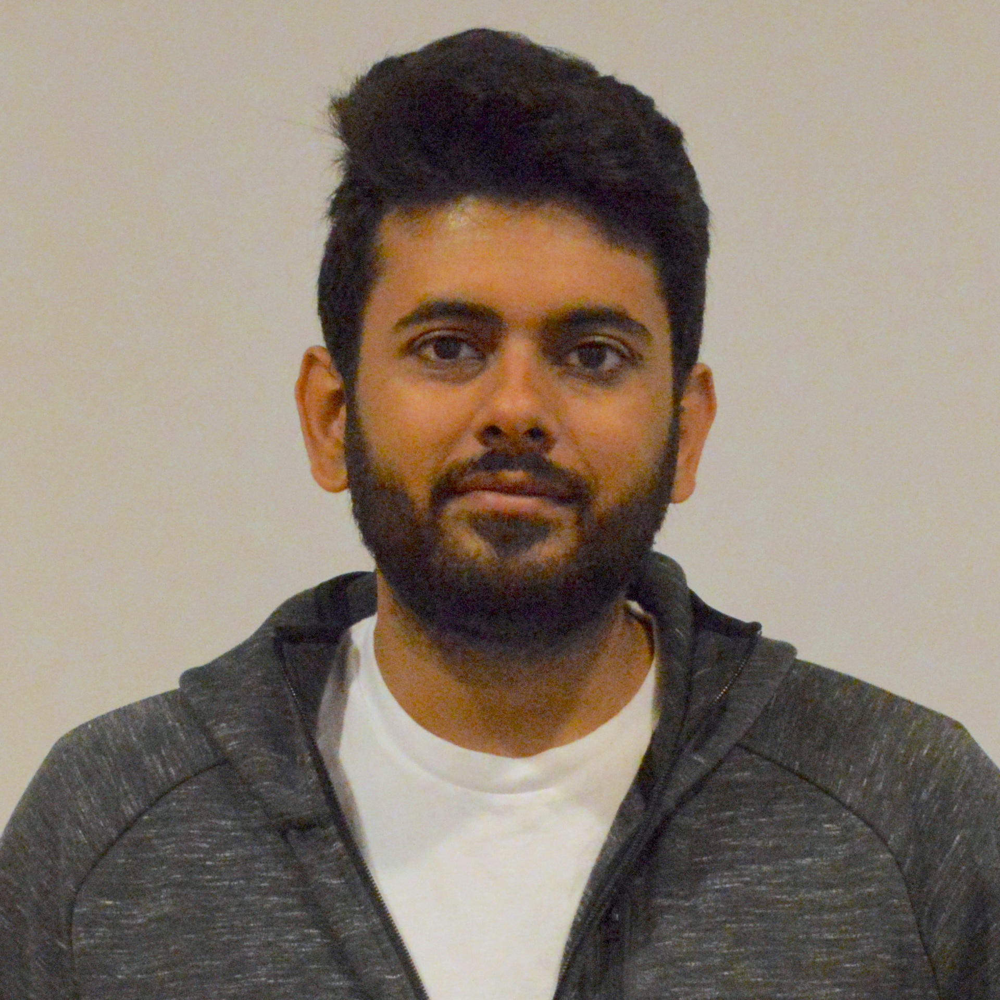

```{r, echo=FALSE, out.width="25%", fig.align='center'}

```

### Hello World!
Welcome to my portfolio page! I am currently a graduate student at [Weill Cornell Medicine](https://www.weill.cornell.edu) in New York City and I am pursuing a master's degree in biostatistics and data science. Before starting graduate school, I worked as a data engineer at [Model N](https://www.modeln.com) which is a life sciences software company based in San Francisco,CA. I hold an undergraduate degree in mechanical engineering from [Texas A&M University](https://www.tamu.edu). I grew up in India and came to the United States for college in Fall 2011 as I wanted to start exploring the world and meet new people. Please refer to my [resume](https://github.com/deepak915/deepak915.github.io/blob/master/DHANKANI_DEEPAK.pdf) for further details about my credentials and feel free to contact me if you have any questions!