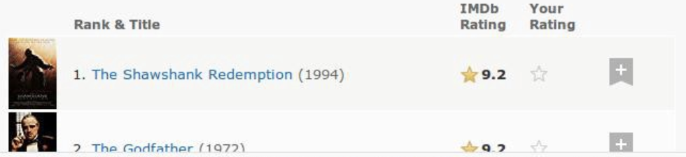
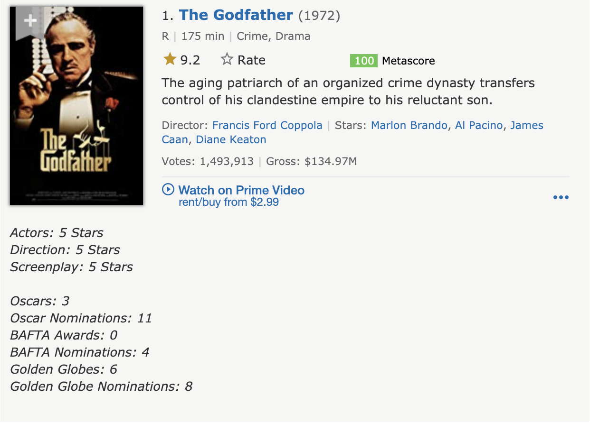
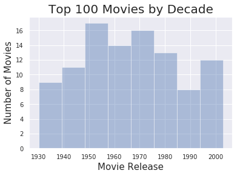

## Blog Post 2: Web Scraping with Python
### December 19, 2019
### Deepak Dhankani

Scraping _tabulated_ data from webpages to build datasets is fairly straight forward with the BeautifulSoup library in Python. However, it takes meticulous effort to extract the data when it is embedded in non-tabulated formats. We will be scraping data from the two of the most common platforms: **Wikipedia** and **IMDb**.

#### PART 1
BeautifulSoup is a robust Python library with numerous functions to facilitate webscraping. We will be extracting data from the Wikipedia page for: *Tech Companies in the NYC area.* First step is import `BeautifulSoup` (for web scraping), `urlopen` (to access data from the URL), and `pandas` for data manipulation.


```python
from bs4 import BeautifulSoup as soup
from urllib.request import urlopen as uReq
import pandas as pd
from IPython.display import Image
import matplotlib.pyplot as plt
import seaborn as sns
```


```python
# storing the URL in a variable
wiki_url = 'https://en.wikipedia.org/wiki/Tech_companies_in_the_New_York_metropolitan_area'
# establishing connection, grabbing the page
url_client = uReq(wiki_url)
```


```python
# offloading the content into a variable
wiki_page = url_client.read()
# closing connection
url_client.close()
```

After we have loaded the URL and stored the webpage data into a variable, we can pass it into the BeautifulSoup function which makes it easier to call different webpage objects like classes, references, paragraphs, etc. The selected format for the data is `html`. In this case, `lxml` would also yield the same output.

Pandas library has a **read_html** function that can extract table from an html object and store it into a dataframe, so it is usually a good practice to check if we can get the data using that function.


```python
wiki_soup = soup(wiki_page, "html.parser")
df = pd.read_html(wiki_page)
print(df)
```

    [    0                                                  1
    0 NaN  This list has no precise inclusion criteria as...]


Now that we know that there aren't any table objects in the HTML data, we can dive deeper into the webpage configuration by going to the page, right clicking and selecting the **Inspect** option. Inspect tab shows that the `mw-parser-output` class contains all the company lists as well as the text data above and below it. The `find` function can be used to look at the contents of all the divisions under the specified class (Output is verbose, hence it is hidden).


```python
# found the class containing the list after inspecting
wiki_soup.find('div',{"class":"mw-parser-output"});
```

A further look through the contents of the `mw-parser-output` class shows that all the objects are tagged in HTML list tags `<li>`, which is can be iterated over and stored in an array! The `find_all` function with paraments *li* and *mw-parser-output* can be used to accomplish this. A for loop can be used to iterate over the HTML lists and append the values into an empty array **company_list**. However, this stores all the description texts into the array as well and since the list objects had no class name associated to them, we can pass an empty class and this should solve the problem! 


```python
company_list = []
for company in wiki_soup.find_all('li',{"class":""}):
    company_list.append(company.text)
    
last = company_list.index('BioValley')
company_list = company_list[0:last]
print(company_list[:7])
```

    ['FanDuel[8]', 'Moonit', 'Trello[9]', 'Enigma Technologies [10]', 'IBM Watson', 'MongoDB', 'BetterCloud[11][12]']


Now that we have an array (python list) containing the required data, we need to clean up a couple of things before proceeding with any further analysis.  Firstly, the list also contains some stray text objects in the end. These can be removed by checking the index of the last company name on the list ('BioValley') and slicing the **company_list** at that index. Secondly, we can see that the company names also include numbers enclosed in square brackets (most likely the reference numbers from the article bibliography section). This can be cleaned by writing a **Regex** function to eliminating all the non-alphabetic characters in the list of strings.


```python
#Another way of extracting the company names, however the output from this required more manual cleaning
alt_list = []
for company in wiki_soup.find_all('a',{"class":""}):
    alt_list.append(company.text.title())
#Third way
#for company in wiki_soup.find_all('ul'):
#    print(company.text)
```

The `re.sub` function takes in the '[^A-Za-z]' which specifies substituting any non-alphabetic characters with with an empty string in the interator variable **element** from the **company_list**. The clean output is stored into a new list called **clean_list**, which is then converted into a pandas dataframe.


```python
# Regex Library 
import re
# new array for clean data
clean_list = []
# implementing regex on all list objects
for element in company_list:
    clean_list.append(re.sub('[^A-Za-z]','',element))

# list to dataframe
company_df = pd.DataFrame(clean_list)
company_df.columns = ['Company_Name']
print(company_df.head())
print(company_df.shape)
```

             Company_Name
    0             FanDuel
    1              Moonit
    2              Trello
    3  EnigmaTechnologies
    4           IBMWatson
    (109, 1)


We finally obtain a dataset of 109 tech companies in the NYC area, which could help with job search for anyone looking for jobs in Tech! The only downside for the above Regex is that it also gets rid of spaces but for now, I am not sure how to fix that but I will come back to it once I am more fluent with Regex.

#### PART 2

Since every webpage is different when comes to embedded data, it is good practice to scrape data from another prominent source - IMDb. In this part, we will be using the *top 100 movies of all time IMDb list*! It is interesting to note that IMDb switched its page format in the recent months, due to which the movies are not tabulated anymore, instead they show up in blocks. See below for a comparison between the two: 

**Old View (Tabulated):**



**New View (Embedded):**


The embedded form presents an interesting challenge for us, so firstly, we will read in the URL, store the contents in a variable and pass it into the BeautifulSoup function with *html.parser* parameter.


```python
imdb_url = 'https://www.imdb.com/list/ls055592025/'
imdb_page = uReq(imdb_url).read()
imdb_soup = soup(imdb_page, "html.parser")
imdb_soup.find('table')
```

A quick look at the **imdb_page** HTML content shows that there are no `<tr>` tags (HTML tabulated data), which means we will have to proceed further with the **Inspect** option on the browser to find out the class heirarchy. The `lister-list` class contains all the movie blocks on the page and there are atleast 5 other classes in the heirarchy below `lister-list`.

Iterating over the contents of `lister-list` and selecting `h3` HTML tag yields the movie rank, movie name, and the year of release. This data is appended into **movie_list** array, which turns out to have a length of 100 (equal to the total number of movies), thus we don't have any data to slice out.


```python
imdb_lister = imdb_soup.find('div',{"class":"lister-list"})
```


```python
movie_list = []
for movie in imdb_lister.findAll('h3'):
    movie_list.append(movie.text)

print(movie_list[0:3])
print(len(movie_list))
```

    ['\n1.\nThe Godfather\n(1972)\n', '\n2.\nThe Shawshank Redemption\n(1994)\n', "\n3.\nSchindler's List\n(1993)\n"]
    100


The above data does not contain movie ratings, which is essential for our data analysis. After looking at the **Inspect** tab of the browser, we find that the `lister-list` class has 5 levels of heirarchy below it and one of the bottom most branches named `ipl-rating-star__rating` class contains the rating information. In the below function, we iterate over the parent class of the rating `ipl-rating-widget` and extract the text out of `span` tag with the class `ipl-rating-star__rating`. All the ratings are stored in **imdb_rating** array (final length 100).

Figuring out this heirarchical behavior was not very straight forward, I tried multiple methods and finally streamlined the final version to the above method. This part took a while but I learned a lot while getting over this hurdle!


```python
imdb_rating = []

for element in imdb_lister.findAll('div',{"class":"ipl-rating-widget"}):
    imdb_rating.append(element.find('span',{'class':'ipl-rating-star__rating'}).text)
    
print(imdb_rating[0:5])
```

    ['9.2', '9.3', '8.9', '8.2', '8.5']


Data cleaning steps involve:
- Converting the **movie_list** array into a dataframe and splitting the column into 3 separate columns using `str.split` by the occurance of '\\n'
- Converting the **imdb_rating** array into a dataframe and merging the two dataframes and assigning relevant column names


```python
movie_df = pd.DataFrame(movie_list)
movie_df.columns = ['all_data']
split_df = movie_df['all_data'].str.split('\\n',n = 4, expand = True)
```


```python
split_df.head()
```


<div>
<style scoped>
    .dataframe tbody tr th:only-of-type {
        vertical-align: middle;
    }

    .dataframe tbody tr th {
        vertical-align: top;
    }

    .dataframe thead th {
        text-align: right;
    }
</style>
<table border="1" class="dataframe">
  <thead>
    <tr style="text-align: right;">
      <th></th>
      <th>0</th>
      <th>1</th>
      <th>2</th>
      <th>3</th>
      <th>4</th>
    </tr>
  </thead>
  <tbody>
    <tr>
      <th>0</th>
      <td></td>
      <td>1.</td>
      <td>The Godfather</td>
      <td>(1972)</td>
      <td></td>
    </tr>
    <tr>
      <th>1</th>
      <td></td>
      <td>2.</td>
      <td>The Shawshank Redemption</td>
      <td>(1994)</td>
      <td></td>
    </tr>
    <tr>
      <th>2</th>
      <td></td>
      <td>3.</td>
      <td>Schindler's List</td>
      <td>(1993)</td>
      <td></td>
    </tr>
    <tr>
      <th>3</th>
      <td></td>
      <td>4.</td>
      <td>Raging Bull</td>
      <td>(1980)</td>
      <td></td>
    </tr>
    <tr>
      <th>4</th>
      <td></td>
      <td>5.</td>
      <td>Casablanca</td>
      <td>(1942)</td>
      <td></td>
    </tr>
  </tbody>
</table>
</div>


The n was set to 4 as there are 4 occurances of '\\n' in each record, so to get rid of all of them extra columns 0 and 4 are created. We can now assign rows 1, 2, and 3 back to **movie_df** with relevant column names and also merge the ratings data into **movie_df**.


```python
movie_df['Movie_Rank'] = split_df[1]
movie_df['Movie_Name'] = split_df[2]
movie_df['Release_Year'] = split_df[3]
movie_df['Rating'] = pd.DataFrame(imdb_rating)[0]
```


```python
movie_df.head()
```


<div>
<style scoped>
    .dataframe tbody tr th:only-of-type {
        vertical-align: middle;
    }

    .dataframe tbody tr th {
        vertical-align: top;
    }

    .dataframe thead th {
        text-align: right;
    }
</style>
<table border="1" class="dataframe">
  <thead>
    <tr style="text-align: right;">
      <th></th>
      <th>all_data</th>
      <th>Movie_Rank</th>
      <th>Movie_Name</th>
      <th>Release_Year</th>
      <th>Rating</th>
    </tr>
  </thead>
  <tbody>
    <tr>
      <th>0</th>
      <td>\n1.\nThe Godfather\n(1972)\n</td>
      <td>1.</td>
      <td>The Godfather</td>
      <td>(1972)</td>
      <td>9.2</td>
    </tr>
    <tr>
      <th>1</th>
      <td>\n2.\nThe Shawshank Redemption\n(1994)\n</td>
      <td>2.</td>
      <td>The Shawshank Redemption</td>
      <td>(1994)</td>
      <td>9.3</td>
    </tr>
    <tr>
      <th>2</th>
      <td>\n3.\nSchindler's List\n(1993)\n</td>
      <td>3.</td>
      <td>Schindler's List</td>
      <td>(1993)</td>
      <td>8.9</td>
    </tr>
    <tr>
      <th>3</th>
      <td>\n4.\nRaging Bull\n(1980)\n</td>
      <td>4.</td>
      <td>Raging Bull</td>
      <td>(1980)</td>
      <td>8.2</td>
    </tr>
    <tr>
      <th>4</th>
      <td>\n5.\nCasablanca\n(1942)\n</td>
      <td>5.</td>
      <td>Casablanca</td>
      <td>(1942)</td>
      <td>8.5</td>
    </tr>
  </tbody>
</table>
</div>


Final data cleaning steps involve:
- Dropping the **all_data** column
- Removing the **.** from the Movie_Rank
- Removing the parentheses from the Release_Year


```python
movie_df = movie_df.drop(columns = 'all_data')
movie_df['Movie_Rank'] = movie_df['Movie_Rank'].str.replace('[^0-9]','')
movie_df['Release_Year'] = movie_df['Release_Year'].str.replace('[^0-9]','')
movie_df.Release_Year = movie_df.Release_Year.astype('int32')
movie_df.Movie_Rank = movie_df.Movie_Rank.astype('int32')
```


```python
movie_df.head()
```


<div>
<style scoped>
    .dataframe tbody tr th:only-of-type {
        vertical-align: middle;
    }

    .dataframe tbody tr th {
        vertical-align: top;
    }

    .dataframe thead th {
        text-align: right;
    }
</style>
<table border="1" class="dataframe">
  <thead>
    <tr style="text-align: right;">
      <th></th>
      <th>Movie_Rank</th>
      <th>Movie_Name</th>
      <th>Release_Year</th>
      <th>Rating</th>
    </tr>
  </thead>
  <tbody>
    <tr>
      <th>0</th>
      <td>1</td>
      <td>The Godfather</td>
      <td>1972</td>
      <td>9.2</td>
    </tr>
    <tr>
      <th>1</th>
      <td>2</td>
      <td>The Shawshank Redemption</td>
      <td>1994</td>
      <td>9.3</td>
    </tr>
    <tr>
      <th>2</th>
      <td>3</td>
      <td>Schindler's List</td>
      <td>1993</td>
      <td>8.9</td>
    </tr>
    <tr>
      <th>3</th>
      <td>4</td>
      <td>Raging Bull</td>
      <td>1980</td>
      <td>8.2</td>
    </tr>
    <tr>
      <th>4</th>
      <td>5</td>
      <td>Casablanca</td>
      <td>1942</td>
      <td>8.5</td>
    </tr>
  </tbody>
</table>
</div>


Finally, we have clean, tabulated data for the top Hollywood 100 movies of all time! When the candidate has used the company list from part 1 to secure a job, this dataset could come in handy for a consolidated list of movies to watch before joining!


```python
#movie_df.info()
sns.set(color_codes=True)
sns.distplot(movie_df.Release_Year, bins = 8, kde = False).set_title('Top 100 Movies by Decade',fontsize = 20)
plt.xlabel("Movie Release", fontsize = 15)
plt.ylabel("Number of Movies",fontsize = 15)
plt.tick_params(labelsize=10)
```




The histogram shows that 1950-1970 produced the most number of all time Top 100 movies.
